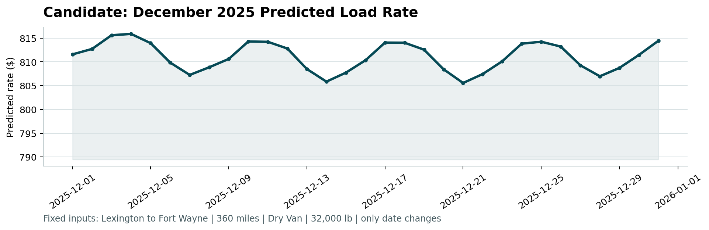

# Freight Rate Prediction

A reproducible solution for the Machine Learning Engineer assessment. It predicts all 12,000 November-December 2025 loads and the required 31-day fixed December scenario.

## Quick start

Use **CPython 3.12 or 3.13**. The full pipeline was verified with Python 3.13.7 and the pinned versions in `requirements.txt`.

On Windows PowerShell:

```powershell
py -3.12 -m venv .venv
.venv\Scripts\python.exe -m pip install -r requirements.txt
.venv\Scripts\python.exe fit_submission.py
.venv\Scripts\python.exe score.py --predictions validation_predictions.csv --december-predictions december_predictions.csv --output-dir results
```

On macOS or Linux, with a supported Python version:

```bash
python3 -m venv .venv
.venv/bin/python -m pip install -r requirements.txt
.venv/bin/python fit_submission.py
.venv/bin/python score.py --predictions validation_predictions.csv --december-predictions december_predictions.csv --output-dir results
```

The full run audits the data, evaluates forward folds, runs the unseen-city stress test, refits on all labeled data, and regenerates both prediction files and the chart. It uses four CPU threads and requires no GPU. Runtime depends on the machine.

To regenerate only predictions and the chart after reviewing validation:

```bash
python fit_submission.py --skip-evaluation
```

For an isolated reproduction, use `--output-dir path/to/output`. Input paths default to the directory containing the code; `--data-dir` overrides that directory. Original input CSVs are never overwritten.

## Files

| File | Purpose |
|---|---|
| `freight_prep.py` | Input checks, data audit, cleaning, and deterministic feature engineering |
| `fit_submission.py` | Shared model implementation, forward validation, full-data refit, and export |
| `analysis.ipynb` | One executed notebook covering the data audit, preprocessing, model comparisons, diagnostics, and exact exports |
| `score.py` | Supplied scorer, preserved unchanged |
| `requirements.txt` | Pinned model and scorer dependencies |
| `train-test.csv` | Supplied 48,000-row labeled development data |
| `validation.csv` | Supplied 12,000-row unlabeled final-validation data |
| `validation-predictions-template.csv` | Supplied ID order and output template |
| `december-chart-inputs.csv` | Supplied fixed December scenario, preserved unchanged |
| `validation_predictions.csv` | Final predictions: exactly `load_id,predicted_rate` |
| `december_predictions.csv` | Completed seven-column, 31-day December scenario |
| `results/validation_summary.json` | Audit, input hashes, environment, splits, parameters, scores, and diagnostics |
| `results/candidate_december.png` | Required chart produced with the supplied scorer |
| `report.pdf` | Final methodology, validation, diagnostics, and December chart |

The notebook is already executed and readable on GitHub without additional dependencies. To execute it locally, install Jupyter in the same environment (`python -m pip install jupyterlab`) and select that environment's Python kernel. Runtime dependencies for the command-line pipeline are kept separate from the notebook interface.

Read the notebook from top to bottom: **data audit → preprocessing and feature engineering → model selection and delivery**. Each stage connects observed evidence to a modeling decision. It includes full schema and missingness checks, weight-anomaly evidence, monthly quote relationships, inference coverage, training-only preprocessing checks, per-period model tradeoffs, and error diagnostics by equipment, month, distance, and tail. The final cells reproduce the submission and verify agreement with the saved validation summary.

## Validation approach

Development covers January-October 2025; final validation covers November-December. Three expanding-window folds each forecast **two complete future months**:

| Training period | Training rows | Outer validation period | Validation rows |
|---|---:|---|---:|
| 2025-01-01 to 2025-04-30 | 19,110 | 2025-05-01 to 2025-06-30 | 9,696 |
| 2025-01-01 to 2025-06-30 | 28,806 | 2025-07-01 to 2025-08-31 | 9,671 |
| 2025-01-01 to 2025-08-31 | 38,477 | 2025-09-01 to 2025-10-31 | 9,523 |

Early stopping uses the last calendar month **within each training window**, with up to 600 trees and 60 rounds of patience. The chosen tree count is then refitted on that entire training window. Imputers, scalers, category vocabularies, and population fallback statistics are fitted only on training rows. No outer-fold outcomes or final-validation labels enter a fit.

The folds informed model selection. These are **internal selection-validation scores**, not a claim about an untouched labeled test set. All 28,890 outer predictions are pooled when computing the following metrics:

| Model | MAE ($) | RMSE ($) |
|---|---:|---:|
| Training median | 1,151.03 | 1,573.03 |
| Robust rich regression | 127.77 | 634.35 |
| Seasonal rich CatBoost | 130.26 | 636.43 |
| Selected rich ensemble | 126.07 | 634.59 |
| CatBoost with quote signal | 133.54 | 636.95 |
| Robust core regression | 139.99 | 636.84 |
| Seasonal core CatBoost RPM | 146.43 | 639.24 |
| Selected core ensemble | 137.23 | 636.11 |

The rich ensemble's median absolute error is **$50.35** and its 90th-percentile absolute error is **$176.93**. The worst 1% of absolute errors account for **96.6%** of total squared error; no rows are removed from any metric.

An additional city stress test withholds Atlanta, Dallas, Denver, Houston, Miami, Portland, Seattle, and Tampa from January-June training. On 1,009 July-August loads involving those cities, rich MAE is **$91.98** and core MAE is **$102.58**. This is an internal robustness diagnostic.

## Modeling and data-quality decisions

- **Weight correction:** preserve absolute magnitudes for 292 negative development weights and 145 negative final-validation weights, under an explicit sign-error assumption. Retain an anomaly flag. True missing weights remain NaN.
- **Missing values:** CatBoost handles numeric NaNs directly. Robust regression uses training-fitted median imputation and scaling. No global imputation is performed.
- **Target extremes:** retain all labeled loads. MAE and Huber losses reduce sensitivity to extremes; RMSE and tail diagnostics remain reported.
- **Rich ensemble:** 50% seasonal CatBoost with MAE loss, depth 6, learning rate 0.05; 50% Huber regression on a distance-interaction design. Rich features include coordinates and market index.
- **Core ensemble:** 50% seasonal CatBoost on rate per mile, depth 4; 50% robust dollar regression. Distance weights make RPM MAE proportional to dollar MAE during both fitting and early stopping. Core features require only the fields in the December scenario.
- **Temporal logic:** a single annual sine/cosine pair represents smooth seasonality. Day of month and weekday are retained. The selected trees omit raw month and day-of-year to reduce dependence on one-way calendar thresholds.
- **Quote signal:** strong monthly sign reversals make extrapolation uncertain. A quote-inclusive candidate is evaluated; the selected ensemble excludes the signal. `load_id` is also excluded from modeling.
- **Unseen cities:** the robust component uses the training-population contribution for an unknown city label. The rich tree also receives supplied coordinates. No city lookup or external geographic data is required.

After the procedure is fixed, October selects the final tree counts, followed by refitting on all **48,000** development loads. The final rich tree uses **476** trees and the core tree **510**; both use seed 42. Huber regression uses epsilon 1.35 and L2 alpha 0.01. Numeric parameters and input SHA-256 hashes are recorded in the validation summary.

## Required December chart



Lexington to Fort Wayne; 360 miles; Dry Van; 32,000 lb; December 1-31, 2025. Only the date changes. The core scenario range is **$805.56 to $815.87**. Coordinates and market fields are not supplied and are excluded throughout core training and inference.

This curve is a model scenario, not an observed-rate comparison or a calibrated confidence interval. Only ten months of one year are labeled, so winter behavior and the annual-seasonality assumption cannot be independently verified.

## Submission integrity

The supplied scorer verifies exactly 12,000 unique expected IDs, the required column order, finite positive rates, all 31 December dates, and the unchanged fixed scenario inputs. The prediction CSV is filled in the exact order of the supplied template. The scorer **does not calculate final accuracy**: hidden target labels are not present in these files.

## Implementation references

- [CatBoost numeric missing-value handling](https://catboost.ai/docs/en/concepts/algorithm-missing-values-processing)
- [scikit-learn HuberRegressor](https://scikit-learn.org/stable/modules/generated/sklearn.linear_model.HuberRegressor.html)
